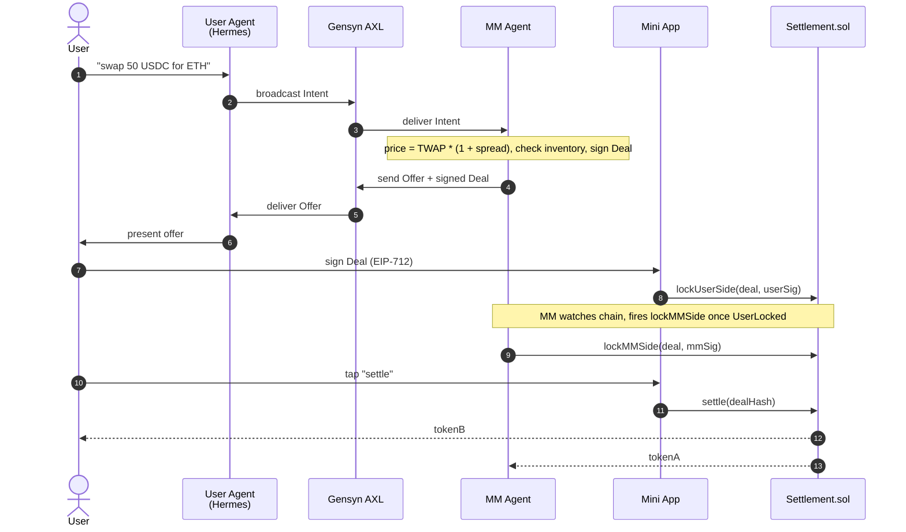

# Parley

**The agent layer for peer DeFi.** AI-driven counterparties negotiate trades over an encrypted P2P mesh and settle atomically on Ethereum.

## Demo

**Phase 1 — terminal-only end-to-end trade on Sepolia.**

https://github.com/user-attachments/assets/1454da20-ed7a-4cea-bfa7-a44a066da926

A user broadcasts an intent over [Gensyn AXL](https://github.com/gensyn-ai/axl); a market-maker agent prices it deterministically and signs an EIP-712 offer; both sides lock collateral in `Settlement.sol`; `settle()` transfers atomically. No LLM in the MM pricing path; no broker; user funds never leave the user's wallet except into the settlement contract.

## How it works

- **Settlement** — single Solidity contract, two-sided lock + atomic swap, EIP-712 signed deals. Deployed at [`0xE5e7…E219`](https://sepolia.etherscan.io/address/0xE5e766d8fEdd8705d537D0016f1A2bff852fE219) on Sepolia. Source: `packages/contracts/`.
- **Transport** — Gensyn AXL: encrypted Yggdrasil mesh with a polled local HTTP API. No central broker; no presence; no push.
- **User Agent** — [Hermes Agent](https://nousresearch.com/) (LLM-driven via 0G Compute) + custom MCP servers + AXL sidecar. Source: `packages/user-agent/`.
- **MM Agent** — deterministic TypeScript daemon, *no LLM in the pricing path*. Source: `packages/mm-agent/`.
- **Mini App** — Next.js + WalletConnect, runs inside Telegram. The only place a user's wallet ever signs. Source: `packages/miniapp/`.
- **Identity** — MMs as ENS subnames under `parley.eth` (canonical); users by wallet address.
- **Reputation** — `TradeRecord` blobs on 0G Storage; scores computed on demand, not stored.
- **Fallback** — Uniswap Trading API when no peer offer arrives.

A trade end-to-end:



See [`SPEC.md`](SPEC.md) for the full protocol design.

## Status

| Phase | Outcome | State |
|---|---|---|
| 0 | Every external dep reachable, credentials in place | ✅ done |
| 1 | One trade settles end-to-end on Sepolia (terminal-only demo) | ✅ done |
| 2 | Telegram bot + Mini App + Hermes runtime | 🚧 next |
| 3 | ENS identity layer (real on-chain MM resolution) | pending |
| 4 | Reputation, refunds, observability | pending |
| 5 | Uniswap fallback + polish | pending |

## Run the Phase 1 demo

Three local processes; full instructions and prerequisites in [`ROADMAP.md`](ROADMAP.md). Quick version:

```bash
# 1. AXL nodes (hub for User Agent on :9002, spoke for MM Agent on :9012)
~/GitHub/axl/node -config /tmp/axl-test/hub/node-config.json   &
~/GitHub/axl/node -config /tmp/axl-test/spoke/node-config.json &

# 2. MM Agent (long-running)
cd packages/mm-agent
AXL_HTTP_URL=http://127.0.0.1:9012 \
  node --env-file=../../.env --import=tsx src/index.ts

# 3. User trade script (one-shot)
USER_AXL_HTTP_URL=http://127.0.0.1:9002 \
  pnpm -F @parley/user-agent phase1:trade
```

Prereqs: Node 24+, pnpm 10+, Foundry, Go 1.25+ (for the AXL binary), Sepolia-funded wallets for the user persona and the MM operator, `.env` populated from [`.env.example`](.env.example).

## Repository layout

```
packages/
├── contracts/      # Foundry — Settlement.sol + tests + deploy scripts
├── shared/         # TS types shared across agents (Intent, Offer, Deal, TradeRecord)
├── user-agent/     # Hermes config, custom MCPs, AXL sidecar, Phase-1 trade script
├── mm-agent/       # MM daemon (TypeScript, no LLM)
└── miniapp/        # Next.js + wagmi Mini App
docs/               # deployment notes
SPEC.md             # protocol design (source of truth)
ROADMAP.md          # phase-by-phase build plan
CLAUDE.md           # project-specific guidance for AI assistants
```

## License

MIT.
