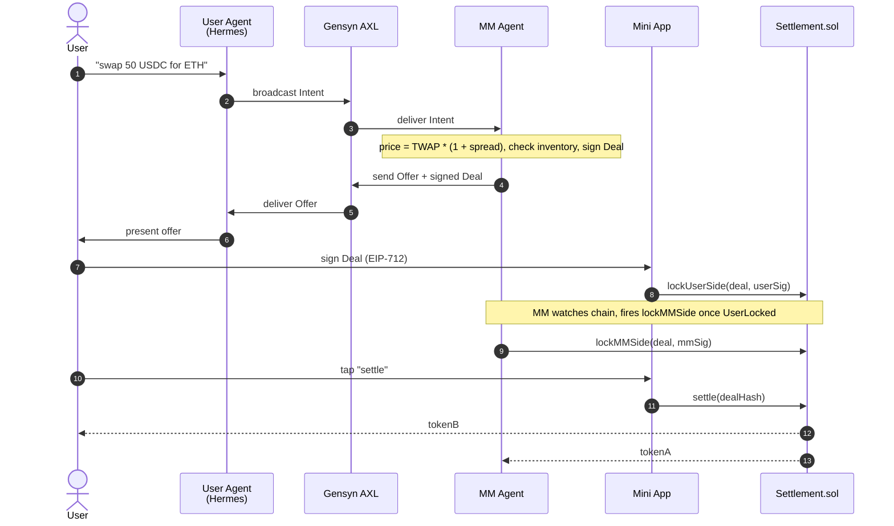
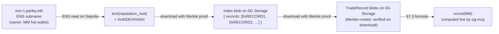

<p align="center">
  <picture>
    <source media="(prefers-color-scheme: dark)" srcset="artifacts/svg/mark-on-dark.svg">
    
  </picture>
</p>

**The agent layer for peer DeFi.** AI-driven counterparties negotiate trades over an encrypted P2P mesh and settle atomically on Ethereum.

## Demo

**Phase 7 — competing market makers on the same intent.** *(Telegram + Mini App + two MM Agents quoting in parallel.)*

[](https://youtu.be/b-EQMxKtrlA)

A user types `swap 50 USDC for ETH` into the bot. Two MM Agents (`mm-1.parley.eth` and `mm-2.parley.eth`) price the intent independently and reply with EIP-712-signed offers. The User Agent ranks them, surfaces a single Telegram card with both options side-by-side (each row shows reputation, output amount, and the "vs Uniswap" delta), and the user picks one with a tap. The picked offer flows through atomic two-sided lock + settle on Sepolia; the unpicked one expires cleanly.

**Phase 1 — terminal-only end-to-end trade on Sepolia.** *(Architectural spine; Phase 2 layered on the Telegram + Mini App user surface.)*

https://github.com/user-attachments/assets/1454da20-ed7a-4cea-bfa7-a44a066da926

A user broadcasts an intent over [Gensyn AXL](https://github.com/gensyn-ai/axl); a market-maker agent prices it deterministically and signs an EIP-712 offer; both sides lock collateral in `Settlement.sol`; `settle()` transfers atomically. No LLM in the MM pricing path; no broker; user funds never leave the user's wallet except into the settlement contract.

## Try it on Sepolia

A live testnet deployment is running. **Bot:** [`@x5ar1ey_bot`](https://t.me/x5ar1ey_bot) on Telegram.

### Prerequisites

- **Telegram** (any version — mobile, desktop, or web).
- **A WalletConnect-compatible wallet.** MetaMask mobile, Rabby, Trust, Coinbase Wallet, Phantom, or any other wallet supporting WalletConnect v2 works. Inside the Telegram in-app browser, only WalletConnect deep-links work — browser-extension wallets aren't reachable from the Telegram webview, so a separate wallet app on your phone is the path of least resistance.
- **Sepolia ETH** for gas — [sepoliafaucet.com](https://sepoliafaucet.com), [alchemy.com/faucets/ethereum-sepolia](https://www.alchemy.com/faucets/ethereum-sepolia), or [cloud.google.com/application/web3/faucet/ethereum/sepolia](https://cloud.google.com/application/web3/faucet/ethereum/sepolia). Around `0.05 ETH` is more than enough for several trades.
- **Sepolia USDC and/or WETH.** Get USDC from Circle's testnet faucet at [faucet.circle.com](https://faucet.circle.com) (select Ethereum Sepolia, paste your address, claim 10 USDC). Get WETH by wrapping a tiny bit of ETH at the Sepolia WETH contract [`0xfFf9…6B14`](https://sepolia.etherscan.io/address/0xfFf9976782d46CC05630D1f6eBAb18b2324d6B14#writeContract) — call `deposit()` with a small `payable` value (e.g., `0.002 ETH`).

### Walk-through

> **A note on commands.** The Parley commands below (`connect`, `balance`, `history`, `policy`, `cancel`, `logout`, `reset`, `help`) are typed **without a leading slash** — they're conversational triggers the agent recognizes from natural language, not Telegram bot commands. If you start a message with `/`, Hermes (the agent runtime) will reply with *"Unknown command"* before the LLM ever sees it. The only `/`-prefixed commands are Hermes' built-ins (`/start`, `/commands`).

**1. Connect wallet.** Open Telegram, search [`@x5ar1ey_bot`](https://t.me/x5ar1ey_bot), tap *Start*. Type `connect` (or just say what you want to do — *"swap 5 USDC to ETH"* — and the bot will prompt for connect first). The bot replies with a *Connect wallet* button.

> **Tap the button inside Telegram** — don't long-press → *Open in Browser*. The Mini App needs Telegram's `WebApp` runtime to relay your signature back to the bot. Outside of Telegram, the relay channel is broken.

In the Mini App, pick **WalletConnect**, scan the QR with your wallet (or tap a wallet name on mobile to deep-link), approve the session. You'll be asked to sign a small message — that's the **session binding** (proves you control the wallet you just connected; valid 24h). The bot acknowledges with your address.

**2. Issue an intent.** Type a swap in plain language:

```
swap 5 USDC for ETH
swap 0.001 ETH for USDC
```

The bot:
- Builds an Intent (your swap parameters as a structured object) and shows you the parameters
- Asks you to **authorize the intent** — another tap, another EIP-712 signature inside the Mini App. This binds your intent to your session so the privileged tools (broadcast, accept, write-trade-record per [SPEC §4.3](SPEC.md)) will accept it.
- Broadcasts to all known MMs over the Gensyn AXL mesh and waits up to ~60s for offers.

**3. Pick an offer.** You'll see one Telegram message titled *"💱 Received N offers in T s"* with a row per MM:

```
⭐ Accept mm-1.parley.eth · 0.0033 ETH · saves 0.42% · rep 0.85
   Accept mm-2.parley.eth · 0.0032 ETH · saves 0.10% · rep 0.71
```

The top row (⭐) is the recommended pick — sorted by output amount, most-output-to-you wins. Reputation is shown on each row for transparency but does NOT affect ranking; `policy.min_counterparty_rep` is a floor that drops below-threshold MMs, not a weight. Offers worse than Uniswap render as `⚠ X.XX% worse than Uniswap` instead of `saves X.XX%`.

Tap any row → the **Sign** Mini App opens. Three things happen:

1. **Sign the Deal** (EIP-712) — the canonical settlement terms (tokens, amounts, deadline, nonce). This is what the contract checks at lock + settle time.
2. **Sign the Accept Authorization** (EIP-712) — auth for your agent to send the Accept message to the MM on your behalf.
3. **Submit `lockUserSide` tx** — your wallet pops up to confirm. This is the **only on-chain transaction you submit yourself** for this trade. It pulls `tokenA` (the input you're selling) into the Settlement contract.

If your wallet asks for an `approve` first because you've never spent that token from this address, do that before the lock — the Mini App handles the prompt.

**4. Settle.** Wait ~10–30s. The MM Agent watches the chain, sees `UserLocked`, submits its own `lockMMSide` tx, and the chain transitions to `BothLocked`. The bot polls Settlement state and once it sees `BothLocked` it sends a *Settle* button. Tap → submit `settle()` from the Mini App → atomic swap. You receive your output token; the MM receives the input.

The bot reports the settlement tx hash. Click through to Sepolia Etherscan — you can verify that `Settled(bytes32 indexed dealHash)` was emitted by the contract at [`0xE5e7…E219`](https://sepolia.etherscan.io/address/0xE5e766d8fEdd8705d537D0016f1A2bff852fE219).

**5. Verify.** Type `balance` to see your updated USDC + WETH + ETH. Type `history` to see the trade in your reputation history.

### Other commands worth trying

Type these as plain words — **no leading slash**.

| Command | What it does |
|---|---|
| `help` | Full command reference |
| `balance` | Wallet balances on Sepolia (ETH, USDC, WETH) |
| `history` | Your past trades + reputation score |
| `policy` | Adjust min counterparty rep, max slippage, intent timeout |
| `cancel` | Cancel an in-flight intent before signing |
| `logout` | Wipe session binding (you'll need to `connect` again) |
| `reset` | Clear conversation context |

### Edge cases worth poking at

- **Cancel an intent mid-flight.** Type `cancel` while the bot is *Collecting offers…*. State should clear cleanly; nothing on-chain happens.
- **No peer offer beats Uniswap.** Try a very small or very large swap so the MMs' spread underperforms the Uniswap reference. The bot should offer a direct Uniswap v3 fallback swap (`QuoterV2` + `SwapRouter02` on Sepolia) instead.
- **Refund.** Lock `tokenA` and then never tap *Settle*. After the deal deadline (~5 min), the bot should surface a *Refund* button. Tap it to recover your locked funds. (Hard to trigger reliably because the MM auto-locks fast; mainly useful for reading the contract's `refund` path.)
- **Multiple intents in parallel.** Issue a second swap while the first is mid-settlement. Each deal lives in its own Settlement storage slot; concurrent deals can't interfere with each other.

### If something breaks

| Symptom | Likely cause |
|---|---|
| *"Wrong network — switch your wallet to Sepolia."* | Wallet is on a different chain. Switch to chain ID 11155111. |
| *"Insufficient balance to cover gas or the transfer amount."* | Need more Sepolia ETH (gas) or more of the input token. |
| *"Token allowance is too low. Approve the contract and try again."* | First time spending this token; the Mini App will prompt an `approve` tx. |
| *"Network or RPC error. Try again in a moment."* | Sepolia RPC blip; retry. If persistent, the deployment may be using an unhealthy RPC. |
| Mini App opens in your phone's browser instead of Telegram | You hit *Open in browser* on the long-press. Close it, retap the bot's button — Telegram's `WebApp` runtime is required for the relay round-trip. |
| *"Unknown command. Type /commands…"* | You started a message with `/`. The Parley triggers (`connect`, `balance`, etc.) are typed without the leading slash; only Hermes' built-ins (`/start`, `/commands`) use one. |
| Bot doesn't respond | Session may have expired. Type `connect` to refresh. If the bot remains silent, the deployment may be down. |

### What this proves

Walking through the flow above exercises every load-bearing piece of the protocol:

- **Asymmetric submission**: the User Agent sent zero transactions; everything user-side came from your wallet.
- **EIP-712 binding**: the same `dealHash` was signed by both parties, validated by the contract, and used as the storage key.
- **AXL mesh transport**: your intent reached two independently-running MM containers without any central broker.
- **ENS-resolved identity**: each MM's offer was verified by resolving its ENS subname's `addr` + `axl_pubkey` text records and checking that the AXL sender + EIP-712 signer matched.
- **0G-anchored reputation**: a `TradeRecord` blob was written to 0G Storage and indexed against both your wallet and the MM's ENS name; future `/history` calls fetch and verify it via Merkle proof.
- **Atomic settlement**: `settle()` swapped both sides in a single contract call; no party could rug the other.

## How it works

- **Settlement** — single Solidity contract, two-sided lock + atomic swap, EIP-712 signed deals. Deployed at [`0xE5e7…E219`](https://sepolia.etherscan.io/address/0xE5e766d8fEdd8705d537D0016f1A2bff852fE219) on Sepolia. Source: `packages/contracts/`.
- **Transport** — Gensyn AXL: encrypted Yggdrasil mesh with a polled local HTTP API. No central broker; no presence; no push.
- **User Agent** — [Hermes Agent](https://nousresearch.com/) (LLM-driven; **Claude API** as primary in Phase 2, 0G Compute deferred to Phase 4 pending a broker proxy) + custom MCP servers (`axl-mcp`, `og-mcp`) + AXL sidecar. Source: `packages/user-agent/`.
- **MM Agent** — deterministic TypeScript daemon, *no LLM in the pricing path*. Source: `packages/mm-agent/`.
- **Mini App** — Next.js + WalletConnect + injected (MetaMask/Rabby/Coinbase), runs inside Telegram or any browser. The only place a user's wallet ever signs. Source: `packages/miniapp/`.
- **Identity** — MMs as ENS subnames under `parley.eth` on Sepolia ([`mm-1.parley.eth`](https://sepolia.app.ens.domains/mm-1.parley.eth) and [`mm-2.parley.eth`](https://sepolia.app.ens.domains/mm-2.parley.eth) are live with `addr` + `axl_pubkey` + `agent_capabilities` text records, and quote competing offers in the demo); users by wallet address.
- **Reputation** — both MMs and users have on-chain-anchored reputation scores. See [Reputation](#reputation) below.
- **Fallback** — direct Uniswap v3 (QuoterV2 + SwapRouter02 on Sepolia) when no peer offer arrives; the same on-chain quoter anchors the "vs Uniswap" delta shown on every peer offer.

A trade end-to-end:



See [`SPEC.md`](SPEC.md) for the full protocol design.

## Reputation

Both MMs and users have reputation scores. They're computed live from trade history that lives on 0G Storage, anchored on-chain via ENS — nobody fabricates them. Scores are bounded `[-0.5, 1.0]`, and fresh accounts start at `0.0` (neutral, not negative — so a newcomer isn't penalized for not having a track record yet).

### What you see

When the bot surfaces an offer in Telegram, the MM's reputation is part of the card:

```
💱 Offer from mm-1.parley.eth
   3,006 USDC per WETH  (vs Uniswap 2,994 — saves 0.4%)
   Reputation 0.67  ·  10 settled  ·  0 timeouts
```

The MM sees an analogous summary about you when it decides whether to quote your intent.

### How a score is computed

Bayesian-smoothed (constant `5`), bounded `[-0.5, 1.0]`. Penalties: `0.5` per failed acceptance (user side) or per MM timeout (MM side). Smoothing keeps early scores honest — one good trade doesn't catapult a new account to 1.0.

| Trades observed | Score |
|---|---|
| Fresh account | `0.00` |
| 1 settled, 0 fails | `0.17` |
| 10 settled, 0 fails | `0.67` |
| 50 settled, 0 fails | `0.91` |
| 10 settled, 2 user-side fails | `0.53` |

Full math + edge cases in [`SPEC.md` §7.3](SPEC.md). Constants live at `packages/user-agent/mcps/og-mcp/src/reputation.ts`.

### What counts (and what doesn't)

- **MM "timeout"** — MM accepted your intent, you locked your tokens, MM never locked theirs before the deadline. You had to refund.
- **User "failed acceptance"** — you accepted an offer in Telegram, then never signed `lockUserSide` in the Mini App before the deadline (closed the bot, lost signal, changed your mind silently).
- **Not counted:** on-chain reverts (insufficient approval, RPC flake, etc.). The signal is too ambiguous to penalize an honest user for chain conditions.

### Why you can trust it



Each hop is tamper-evident:

- The **ENS subname** is owned by the MM's hot wallet — only the MM can rewrite the `reputation_root` pointer, and every update is a signed Sepolia transaction (publicly auditable).
- 0G Storage downloads **verify the Merkle proof** against the indexer's commitment, so the bytes returned are provably the bytes uploaded.
- **Both parties write a TradeRecord per trade** with the same `trade_id` (`= dealHash`). A misbehaving party leaves a contradicting record on the other side — visible to anyone who looks.

The read code path is `og-mcp.read_mm_reputation` / `read_user_reputation`; the MM-side write path is `mm-agent/src/reputation-publisher.ts`.

## Status

| Phase | Outcome | State |
|---|---|---|
| 0 | Every external dep reachable, credentials in place | ✅ done |
| 1 | One trade settles end-to-end on Sepolia (terminal-only demo) | ✅ done |
| 2 | Telegram bot + Mini App + Hermes runtime + per-action signatures | ✅ done |
| 3 | ENS identity layer — `mm-1.parley.eth` live on Sepolia | ✅ done |
| 4 | Reputation, refunds, observability | ✅ done |
| 5 | Uniswap fallback + polish | ✅ done |
| 6a | Containerized deployment (local Docker stack) | ✅ done |
| 6b | Single-VPS deployment | 🚧 infra live; security gate pending |
| 7 | Second MM Agent + competitive offer cards | ✅ done |
| 8 | MM Agent live Uniswap reference pricing | ✅ done |
| 9 | Smart routing — partial fills + multi-leg execution | ✅ done |

## Running it

**Prereqs:** Docker (with `compose` plugin), a populated `.env` at the repo root (copy from [`.env.example`](.env.example)), Sepolia-funded wallets for the user persona, MM operator, and `parley.eth` parent, an HTTPS tunnel for the Mini App (cloudflared/ngrok) so Telegram can reach it, and a Telegram bot token. Full operator instructions in [`docs/deployment.md`](docs/deployment.md) and [`ROADMAP.md`](ROADMAP.md).

```bash
make deploy-local
```

That single command generates AXL identities (`infra/state/<agent>/axl.pem` — backed up out-of-band for production), builds three images (`parley-user-agent`, `parley-mm-agent`, `parley-miniapp`), and brings the stack up via `docker compose`. Tail logs with `make logs`; tear down with `make down`.

Then expose the Mini App over HTTPS (e.g., `cloudflared tunnel --url http://localhost:3000` and paste the URL into `MINIAPP_BASE_URL` + Telegram BotFather's `web_app` URL), send the bot "swap 10 USDC for WETH", and walk through `/connect` → `/authorize-intent` → `/sign` → `/settle` in the Mini App. (Real Sepolia USDC/WETH; fund the user persona at [faucet.circle.com](https://faucet.circle.com) and wrap a little Sepolia ETH into WETH at `0xfFf9976782d46CC05630D1f6eBAb18b2324d6B14`.)

**Image layout** (per [`infra/`](infra/)): the User Agent image bundles Hermes (Python) + the MCP servers + AXL sidecar + AXL Go binary under one `supervisord`. The MM Agent image bundles `mm-agent` + AXL Go binary. The Mini App ships Next.js standalone output. AXL identities are bind-mounted from the host so image rebuilds don't churn ENS `axl_pubkey` records.

**One-shot scripts** (still useful as health checks, run on the host): see `pnpm -F @parley/user-agent` for `phase0:zg-compute`, `phase0:zg-storage`, `phase3:register-mm`.

## Repository layout

```
packages/
├── contracts/      # Foundry — Settlement.sol + tests + deploy scripts (incl. TestERC20)
├── shared/         # TS types + EIP-712 schemas shared across agents
├── user-agent/     # Hermes config (SOUL.md, skills) + axl-mcp + og-mcp + AXL sidecar
├── mm-agent/       # MM daemon (TypeScript, no LLM)
└── miniapp/        # Next.js + wagmi Mini App (Telegram + browser)
artifacts/          # Logo pack (SVG sources, PNG/ICO/manifest derivatives)
docs/               # Deployment notes
infra/              # Dockerfiles, supervisord/AXL configs, entrypoint scripts
compose.yml         # 4-service local stack (user-agent, mm-agent, mm-agent-2, miniapp)
Makefile            # `make deploy-local` and friends
SPEC.md             # Protocol design (source of truth)
ROADMAP.md          # Phase-by-phase build plan
CLAUDE.md           # Project-specific guidance for AI assistants
```

## License

MIT.
