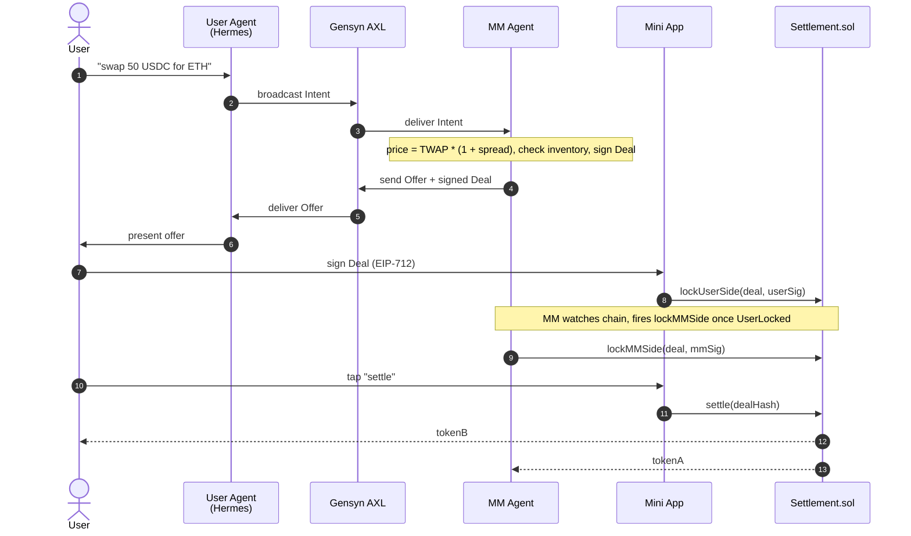
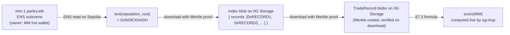

<p align="center">
  <picture>
    <source media="(prefers-color-scheme: dark)" srcset="artifacts/svg/mark-on-dark.svg">
    
  </picture>
</p>

**The agent layer for peer DeFi.** AI-driven counterparties negotiate trades over an encrypted P2P mesh and settle atomically on Ethereum.

## Demo

**Phase 1 — terminal-only end-to-end trade on Sepolia.** *(Architectural spine; Phase 2 layered on the Telegram + Mini App user surface.)*

https://github.com/user-attachments/assets/1454da20-ed7a-4cea-bfa7-a44a066da926

A user broadcasts an intent over [Gensyn AXL](https://github.com/gensyn-ai/axl); a market-maker agent prices it deterministically and signs an EIP-712 offer; both sides lock collateral in `Settlement.sol`; `settle()` transfers atomically. No LLM in the MM pricing path; no broker; user funds never leave the user's wallet except into the settlement contract.

## How it works

- **Settlement** — single Solidity contract, two-sided lock + atomic swap, EIP-712 signed deals. Deployed at [`0xE5e7…E219`](https://sepolia.etherscan.io/address/0xE5e766d8fEdd8705d537D0016f1A2bff852fE219) on Sepolia. Source: `packages/contracts/`.
- **Transport** — Gensyn AXL: encrypted Yggdrasil mesh with a polled local HTTP API. No central broker; no presence; no push.
- **User Agent** — [Hermes Agent](https://nousresearch.com/) (LLM-driven; **Claude API** as primary in Phase 2, 0G Compute deferred to Phase 4 pending a broker proxy) + custom MCP servers (`axl-mcp`, `og-mcp`) + AXL sidecar. Source: `packages/user-agent/`.
- **MM Agent** — deterministic TypeScript daemon, *no LLM in the pricing path*. Source: `packages/mm-agent/`.
- **Mini App** — Next.js + WalletConnect + injected (MetaMask/Rabby/Coinbase), runs inside Telegram or any browser. The only place a user's wallet ever signs. Source: `packages/miniapp/`.
- **Identity** — MMs as ENS subnames under `parley.eth` on Sepolia ([`mm-1.parley.eth`](https://sepolia.app.ens.domains/mm-1.parley.eth) is live with `addr` + `axl_pubkey` + `agent_capabilities` text records); users by wallet address.
- **Reputation** — both MMs and users have on-chain-anchored reputation scores. See [Reputation](#reputation) below.
- **Fallback** — direct Uniswap v3 (QuoterV2 + SwapRouter02 on Sepolia) when no peer offer arrives; the same on-chain quoter anchors the "vs Uniswap" delta shown on every peer offer.

A trade end-to-end:



See [`SPEC.md`](SPEC.md) for the full protocol design.

## Reputation

Both MMs and users have reputation scores. They're computed live from trade history that lives on 0G Storage, anchored on-chain via ENS — nobody fabricates them. Scores are bounded `[-0.5, 1.0]`, and fresh accounts start at `0.0` (neutral, not negative — so a newcomer isn't penalized for not having a track record yet).

### What you see

When the bot surfaces an offer in Telegram, the MM's reputation is part of the card:

```
💱 Offer from mm-1.parley.eth
   3,006 USDC per WETH  (vs Uniswap 2,994 — saves 0.4%)
   Reputation 0.67  ·  10 settled  ·  0 timeouts
```

The MM sees an analogous summary about you when it decides whether to quote your intent.

### How a score is computed

Bayesian-smoothed (constant `5`), bounded `[-0.5, 1.0]`. Penalties: `0.5` per failed acceptance (user side) or per MM timeout (MM side). Smoothing keeps early scores honest — one good trade doesn't catapult a new account to 1.0.

| Trades observed | Score |
|---|---|
| Fresh account | `0.00` |
| 1 settled, 0 fails | `0.17` |
| 10 settled, 0 fails | `0.67` |
| 50 settled, 0 fails | `0.91` |
| 10 settled, 2 user-side fails | `0.53` |

Full math + edge cases in [`SPEC.md` §7.3](SPEC.md). Constants live at `packages/user-agent/mcps/og-mcp/src/reputation.ts`.

### What counts (and what doesn't)

- **MM "timeout"** — MM accepted your intent, you locked your tokens, MM never locked theirs before the deadline. You had to refund.
- **User "failed acceptance"** — you accepted an offer in Telegram, then never signed `lockUserSide` in the Mini App before the deadline (closed the bot, lost signal, changed your mind silently).
- **Not counted:** on-chain reverts (insufficient approval, RPC flake, etc.). The signal is too ambiguous to penalize an honest user for chain conditions.

### Why you can trust it



Each hop is tamper-evident:

- The **ENS subname** is owned by the MM's hot wallet — only the MM can rewrite the `reputation_root` pointer, and every update is a signed Sepolia transaction (publicly auditable).
- 0G Storage downloads **verify the Merkle proof** against the indexer's commitment, so the bytes returned are provably the bytes uploaded.
- **Both parties write a TradeRecord per trade** with the same `trade_id` (`= dealHash`). A misbehaving party leaves a contradicting record on the other side — visible to anyone who looks.

The read code path is `og-mcp.read_mm_reputation` / `read_user_reputation`; the MM-side write path is `mm-agent/src/reputation-publisher.ts`.

## Status

| Phase | Outcome | State |
|---|---|---|
| 0 | Every external dep reachable, credentials in place | ✅ done |
| 1 | One trade settles end-to-end on Sepolia (terminal-only demo) | ✅ done |
| 2 | Telegram bot + Mini App + Hermes runtime + per-action signatures | ✅ done |
| 3 | ENS identity layer — `mm-1.parley.eth` live on Sepolia | ✅ done |
| 4 | Reputation, refunds, observability | ✅ done |
| 5 | Uniswap fallback + polish | ✅ done |
| 6 | Containerized deployment (local Docker → single VPS) | 🚧 next |
| 7 | Second MM Agent + competitive offer cards | ⏭ planned |

## Running it

**Prereqs:** Docker (with `compose` plugin), a populated `.env` at the repo root (copy from [`.env.example`](.env.example)), Sepolia-funded wallets for the user persona, MM operator, and `parley.eth` parent, an HTTPS tunnel for the Mini App (cloudflared/ngrok) so Telegram can reach it, and a Telegram bot token. Full operator instructions in [`docs/deployment.md`](docs/deployment.md) and [`ROADMAP.md`](ROADMAP.md).

```bash
make deploy-local
```

That single command generates AXL identities (`infra/state/<agent>/axl.pem` — backed up out-of-band for production), builds three images (`parley-user-agent`, `parley-mm-agent`, `parley-miniapp`), and brings the stack up via `docker compose`. Tail logs with `make logs`; tear down with `make down`.

Then expose the Mini App over HTTPS (e.g., `cloudflared tunnel --url http://localhost:3000` and paste the URL into `MINIAPP_BASE_URL` + Telegram BotFather's `web_app` URL), send the bot "swap 10 USDC for WETH", and walk through `/connect` → `/authorize-intent` → `/sign` → `/settle` in the Mini App. (Real Sepolia USDC/WETH; fund the user persona at [faucet.circle.com](https://faucet.circle.com) and wrap a little Sepolia ETH into WETH at `0xfFf9976782d46CC05630D1f6eBAb18b2324d6B14`.)

**Image layout** (per [`infra/`](infra/)): the User Agent image bundles Hermes (Python) + the MCP servers + AXL sidecar + AXL Go binary under one `supervisord`. The MM Agent image bundles `mm-agent` + AXL Go binary. The Mini App ships Next.js standalone output. AXL identities are bind-mounted from the host so image rebuilds don't churn ENS `axl_pubkey` records.

**One-shot scripts** (still useful as health checks, run on the host): see `pnpm -F @parley/user-agent` for `phase0:zg-compute`, `phase0:zg-storage`, `phase3:register-mm`.

## Repository layout

```
packages/
├── contracts/      # Foundry — Settlement.sol + tests + deploy scripts (incl. TestERC20)
├── shared/         # TS types + EIP-712 schemas shared across agents
├── user-agent/     # Hermes config (SOUL.md, skills) + axl-mcp + og-mcp + AXL sidecar
├── mm-agent/       # MM daemon (TypeScript, no LLM)
└── miniapp/        # Next.js + wagmi Mini App (Telegram + browser)
artifacts/          # Logo pack (SVG sources, PNG/ICO/manifest derivatives)
docs/               # Deployment notes
infra/              # Dockerfiles, supervisord/AXL configs, entrypoint scripts
compose.yml         # 3-service local stack (user-agent, mm-agent, miniapp)
Makefile            # `make deploy-local` and friends
SPEC.md             # Protocol design (source of truth)
ROADMAP.md          # Phase-by-phase build plan
CLAUDE.md           # Project-specific guidance for AI assistants
```

## License

MIT.
